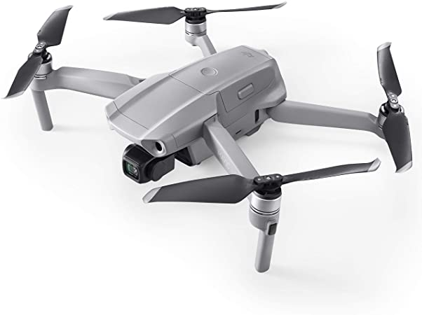

# Choix de drones pour la 3rd Person View : TALOS

| Caractéristiques |Parrot ANAFI | DJI Tello | DJI Mini 2 / SE | DJI Mavic Air 2 | Crazyflie DIY |
| ---------------- | ----------- | --------- | --------------- | --------------- | ------------- |
| Aperçu |  |  |  |  |  |
| Lien |  |  |  |  | |
| Prix | 550€ | 100€ | 550€ | 900€ | A déterminer |
| Dimensions (longueur,larguer,hauteur) | 175x240x65 mm| 98x92.5x41 mm | 159x203x55 mm| 183x253x77 mm | Custom |
| Masse | 320g | 80g | 249g | 570g | Custom |
| Gimbale | 2 axes | 0 axe, fixe | 2 axes | 3 axes | 1 ou 2, 3 à l'idéal |
| API | Olympe : Python / Air SDK 7.0 | Tello EDU : Python | Mobile SDK |  Window SDK | |

# Les points importants :

    - le prix, entre 300€ et 600€.
    - les dimensions ; Pas trop grande pour ne pas géner le Talos ou interférer avec l'environnement. Ni trop petite pour pouvoir transporter le Vive tracker.
    - La mobilité de la caméra. On veut pouvoir bouger la caméra en limitant au maximum les déplacements du drone pour éviter des problèmes de vibrations. une gimbale 2 ou 3 axes serait l'idéale.
    - La possibilité de communiquer avec le drone. Si celui-ci possède un SDK avec un API pour contrôler le drone et la caméra

1. Parrot ANAFI
    - prix convenable
    - ses dimensions son un peu élevées mais restes correctes.
    - possède une gimbale 2 axes
    - il existe un API, Olympe, programmable sur Python
2. DJI Tello :
    - peu chère
    - Possède les bonnes dimensions
    - Pas de gimbale ! caméra fixe
    - programmable sur Python : Tello EDU
3. DJI Mini 2 ou DJI Mini SE :
    - prix correct
    - Les dimensions sont parfaites
    - possède une gimbales 2 axes
    - Possède un SDK mais pour mobile seulement. 
4. DJI Mavic Air 2 :
    - Chère (900€)
    - Dimensions élevés
    - possède une gimbale 3 axes
    - possède un SDK sur Windows.
5. DIY Crazyflie :  
 Cette solution sera basé sur le modèle du Crazyflie 2.0. L'idée sera développée ultérieurement dans un autre document. Les caractéristiques exactes et composants sont à déterminer (ESP 32, moteur brushless, gimbale, caméra...)

les meilleurs drones existant dans le commerce pour le projet serait : le Parrot ANAFI, malgré qu'il soit un peu "gros", celui-ci possède un API (Olympe) sur Python ; puis le DJI Mini 2 ou SE qui possède la taille la plus adapté, mais celui-ci possède seulement une API sur mobile (Android, IOS)